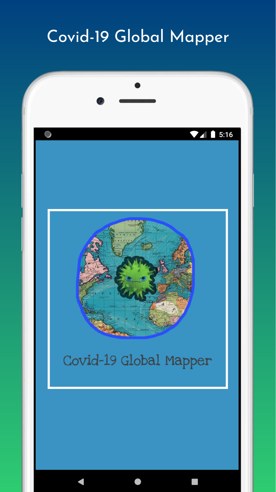

# Covid-19 Global Mapper (Flutter/Dart Project)

_Tracking live Covid-19 cases Globally._

---

In this Application you can track live Covid-19 cases, from all around the world in a Map based view.

## Flutter Plugin's Used :-
- [intl](https://pub.dev/packages/intl "intl plugin")
- [http](https://pub.dev/packages/http "http plugin")
- [font_awesome_flutter](https://pub.dev/packages/font_awesome_flutter "font_awesome_flutter plugin")
- [google_maps_flutter](https://pub.dev/packages/google_maps_flutter "google_maps_flutter plugin")

---

## Let's Talk About UI
Before creating the UI, I focused on the Emphasis of User-Interaction and the application.
> Good Experience = Good Interaction

While creating the UI for the Application at the starting point, I am just having the basic idea of, How the UI going be to look at the end ? So I drew my basic idea on a paper, would like to share with you.

The above page contains the whole idea of my Application **Covid-19 Global Mapper**.

Since **Colors** is very important because it elevates what is it that we are trying to convey to the users.
**Colors** do a lot of work visually.
[Color Tool I Use](https://material.io/resources/color/#!/?view.left=0&view.right=0&primary.color=6002ee)

---

## Final Product
### 1

### 2

### 3

### 4

### 5

### 6

---

## Download it !
**[Covid-19 Global Mapper Apk](https://drive.google.com/file/d/1v2dxtQhV5Wga5kAhRbyJesz-NBv5_qDp/view "Apk")**

---

## API Reference
**[ABOUT-CORONA.NET](https://about-corona.net/documentation "API Docs")**

